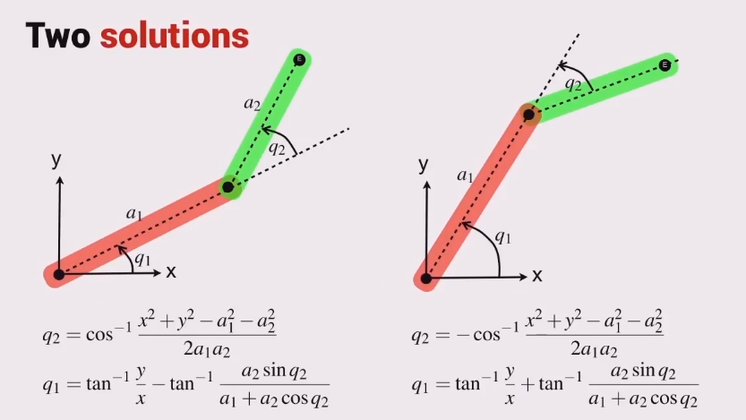

# SCARA Robot: Color-Based Pick and Place Simulation

This project implements a **SCARA (Selective Compliance Assembly Robot Arm)** simulation using **MuJoCo** for physics, **OpenCV** for computer vision, and a **Finite State Machine (FSM)** for logic control. The robot detects colored blocks via a top-down camera, calculates their position in the world frame, and performs a precise pick-and-place operation into corresponding colored bins.

---

##  System Architecture

The system is divided into three primary layers:
1.  **Perception (OpenCV):** Segments the image using HSV thresholding to identify block color and pixel coordinates.
2.  **Kinematics (Inverse Kinematics):** Translates desired Cartesian coordinates $(x, y, z)$ into joint angles $(\theta_1, \theta_2, d_3)$.
3.  **Control (FSM):** Orchestrates the robot's behavior through states like `DETECT_OBJ`, `MOVE_TO_XY`, `VACUUM_ON`, and `MOVE_TO_GOAL`.

---

##  Mathematical Foundations

### 1. Inverse Kinematics (IK)
To move the end-effector to a specific $(x, y)$ coordinate, we must solve for the joint angles. For a 2-link planar arm (the top view of a SCARA), we use the **Law of Cosines**.

Given:
* $L_1 = 0.36, L_2 = 0.32$: Lengths of the first and second arms.
* $(x, y)$: Target coordinates.

**Solving for Joint 2 ($\theta_2$):**
The distance $D$ from the origin to $(x, y)$ is $D^2 = x^2 + y^2$. Using the law of cosines:
$$D^2 = L_1^2 + L_2^2 - 2L_1L_2 \cos(180^\circ - \theta_2)$$
Which simplifies to:
$$\cos(\theta_2) = \frac{x^2 + y^2 - L_1^2 - L_2^2}{2L_1L_2}$$
$$\theta_2 = \arccos\left(\text{clip}\left(\frac{x^2 + y^2 - L_1^2 - L_2^2}{2L_1L_2}, -1.0, 1.0\right)\right)$$

**Solving for Joint 1 ($\theta_1$):**
$$\theta_1 = {atan2}(y, x) - {atan2}(L_2 \sin(\theta_2), L_1 + L_2 \cos(\theta_2))$$

**Joint 3 ($z$):**
The vertical axis is linear (prismatic). It is calculated by a simple offset from the target height:
$$q_3 = z_{target} - 0.40$$

### 2. Computer Vision & Coordinate Mapping
The camera provides a 2D array of pixels. To interact with the world, we map pixel coordinates $(cX, cY)$ to world coordinates $(x, y)$[cite: 1, 3].

**Color Detection:**
We convert the BGR image to **HSV (Hue, Saturation, Value)** because it is more robust to lighting changes.
* **Masking:** Using `cv2.inRange` to isolate Red, Green, and Blue spectrums.
* **Centroid Calculation:** Using image moments $M_{ij}$:
        $$cX = \frac{M_{10}}{M_{00}}, \quad cY = \frac{M_{01}}{M_{00}}$$ 

**Pixel-to-World Transformation:**
A linear ratio maps the 480x480 resolution to the simulation workspace based on the camera center (239, 239) and a ratio of $0.1/173$:
$$obj\_x = -0.55 - (cX - 239) \times \frac{0.1}{173}$$
$$obj\_y = 0 - (cY - 239) \times \frac{0.1}{173}$$

---

##  Control Logic (Finite State Machine)

The robot operates as a sequential process to ensure safety and precision:

| State | Description | Transition Condition |
| :--- | :--- | :--- |
| **DETECT_OBJ** | Scans the table for colored contours. | Object detected & cooldown finished. |
| **MOVE_TO_XY** | Moves the arm horizontally over the block. | Distance to target $< 0.01\text{m}$. |
| **LOWER_Z_AXIS** | Lowers the vacuum gripper to the block surface. | $Z$ distance error $< 0.022\text{m}$. |
| **VACUUM_ON** | Activates the `adhesion` actuator in MuJoCo. | Instantaneous. |
| **LIFT_OBJ** | Raises the block to a safe travel height. | Joint 3 position $> 0.05\text{m}$. |
| **MOVE_TO_GOAL** | Navigates to the specific colored bin. | Distance to goal $< 0.01\text{m}$. |
| **RESET** | Teleports the block back to a random spot. | Time $> 0.5\text{s}$. |

